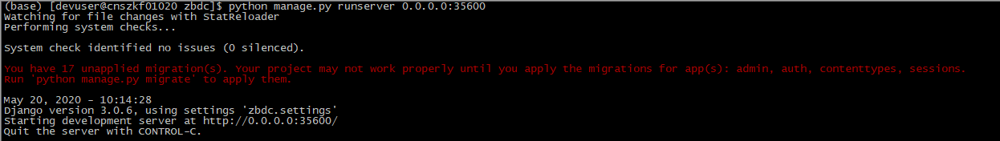

# 模型服务说明文档
## 1、部署
### 环境配置


```python
pip install -r requirements.txt
```

### 运行服务
cd 到image_serv目录下，然后输入以下命令运行服务，若出现如下图结果则运行成功；


```python
python manage.py runserver 0.0.0.0:35600
```



## 2、卡证分类
接口详情见docs下数据平台模型SDK文档.docx中卡证分类部分；
## 3、图像反欺诈
接口详情见docs下数据平台模型SDK文档.docx中卡图像反欺诈部分；
### 接口测试代码
测试代码见retrieval下test.py，示例如下：


```python
if __name__ == '__main__':
    # test_add_feature(r'D:\gyz\ImageRetrieval\data\2020-05-12\fuben')
    # test_global_retrieval(r'D:\gyz\ImageRetrieval\data\2020-05-12\zhuben')
    test_retrieval(r'D:\gyz\ImageRetrieval\data\2020-05-12\zhuben')
```
